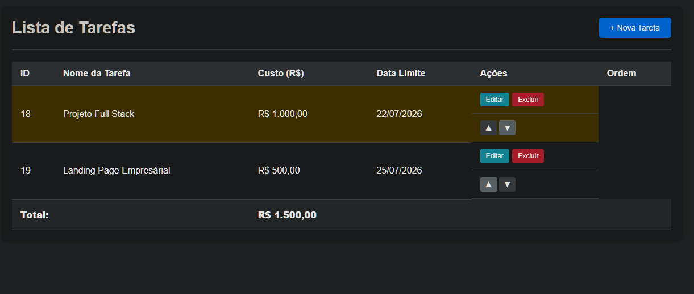

# Sistema Lista de Tarefas


Sistema web para cadastro e gerenciamento de tarefas, com API REST em Node.js/Express e persistência em SQLite. Suporta reordenação por drag-and-drop, validações de negócio (nome único, custo não-negativo, data válida) e deploy containerizado.

## 🌐 Acesso Online

**Aplicação em produção:** https://sistema-tarefas-app.fly.dev/

## Screenshot



## Funcionalidades

- **Listagem de Tarefas**: Exibe todas as tarefas ordenadas por ordem de apresentação
- **Inclusão**: Adiciona novas tarefas com nome, custo e data limite
- **Edição**: Permite alterar nome, custo e data limite de tarefas existentes (via popup)
- **Exclusão**: Remove tarefas com confirmação (Sim/Não)
- **Reordenação**: Botões ▲▼ para subir/descer + arraste e solte (drag-and-drop)
- **Destaque**: Tarefas com custo >= R$ 1.000,00 são destacadas em amarelo
- **Somatório**: Exibe o total dos custos no rodapé
- **Validações**: Nome único, custo >= 0, data válida, campos obrigatórios

## Tecnologias

- **Backend**: Node.js + Express
- **Banco de Dados**: SQLite (sql.js), persistido em arquivo local
- **Frontend**: HTML, CSS e JavaScript puro (sem framework)
- **Containerização**: Docker
- **Hospedagem**: Fly.io

## Arquitetura

Aplicação monolítica simples, sem framework de frontend:

```
├── server.js         # Servidor Express + rotas da API REST
├── database.js       # Camada de acesso ao banco (sql.js) e persistência em disco
├── public/            # Frontend estático servido pelo Express
│   ├── index.html      # Estrutura da página (tabela de tarefas + modais)
│   ├── script.js        # Consome a API via fetch, renderiza a tabela, drag-and-drop
│   └── styles.css
├── Dockerfile         # Build da imagem para deploy em container
└── fly.toml           # Configuração de deploy no Fly.io (volume persistente para o banco)
```

O frontend não usa nenhuma biblioteca: `script.js` faz as chamadas HTTP para `/api/tarefas` e atualiza o DOM diretamente. O banco SQLite roda em memória via `sql.js` e é salvo em disco (`.data/tarefas.db`) a cada escrita — no Fly.io esse diretório é montado como volume persistente (ver `fly.toml`) para sobreviver a reinicializações do container.

## Instalação Local

1. Clone o repositório:
```bash
git clone https://github.com/Dieguin77/sistema-lista-tarefas.git
cd sistema-lista-tarefas
```

2. Instale as dependências:
```bash
npm install
```

3. (Opcional) Copie o arquivo de variáveis de ambiente:
```bash
cp .env.example .env
```

4. Execute o servidor:
```bash
npm start
```

5. Acesse: http://localhost:3000

### Rodando com Docker

```bash
docker build -t sistema-lista-tarefas .
docker run -p 3000:3000 sistema-lista-tarefas
```

## Variáveis de Ambiente

O sistema usa SQLite embutido (sql.js) e não requer nenhum banco de dados externo. Todas as variáveis abaixo são opcionais:

| Variável | Descrição | Padrão |
|----------|-----------|--------|
| PORT | Porta do servidor | 3000 |
| NODE_ENV | Ambiente de execução (`development` ou `production`) | development |

## Estrutura do Banco de Dados

### Tabela: tarefas

| Campo | Tipo | Descrição |
|-------|------|-----------|
| id | INTEGER | Identificador (chave primária, auto-incremento) |
| nome | TEXT | Nome da tarefa (único, case-insensitive) |
| custo | REAL | Custo em R$ (>= 0) |
| data_limite | TEXT | Data limite (formato YYYY-MM-DD) |
| ordem_apresentacao | INTEGER | Ordem de exibição (único) |

### Constraints

- `nome` UNIQUE - Não permite nomes duplicados
- `custo` CHECK (custo >= 0) - Custo não pode ser negativo
- `ordem_apresentacao` UNIQUE - Ordem não pode se repetir

## API Endpoints

| Método | Endpoint | Descrição |
|--------|----------|-----------|
| GET | /api/tarefas | Lista todas as tarefas |
| GET | /api/tarefas/:id | Obtém uma tarefa |
| POST | /api/tarefas | Cria nova tarefa |
| PUT | /api/tarefas/:id | Atualiza tarefa |
| DELETE | /api/tarefas/:id | Exclui tarefa |
| PUT | /api/tarefas/:id/reordenar | Move tarefa (subir/descer) |
| PUT | /api/tarefas/reordenar/drag | Reordena via drag-and-drop |

## Licença

Este projeto está sob a licença MIT — veja o arquivo [LICENSE](LICENSE) para detalhes.
